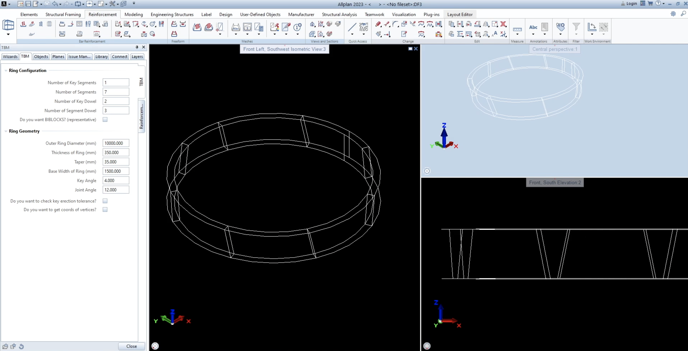
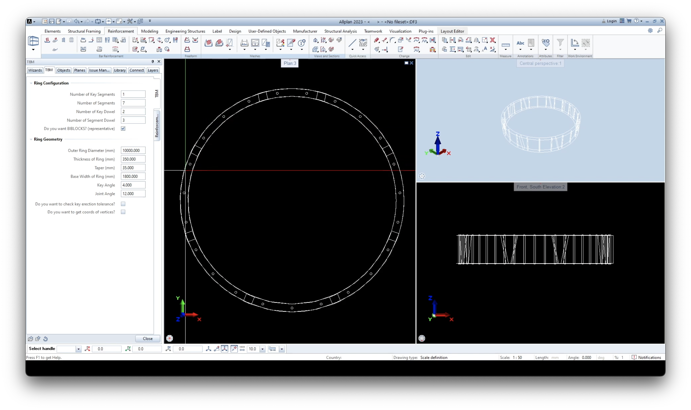
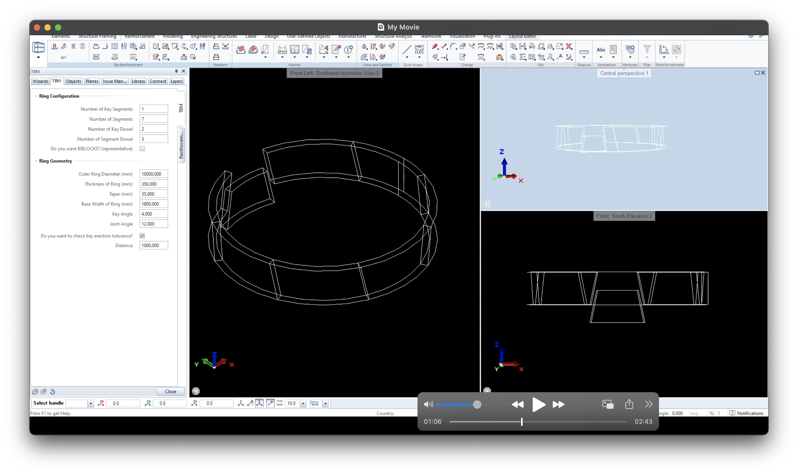

# Allplan TBM Modeler

A parametric 3D modeling tool for tunnel segmental linings based on the Universal Tapered Ring concept, developed with the Allplan Python API.

## 🚀 Project Overview

This project provides an automated solution for modeling Tunnel Boring Machine (TBM) rings, a critical component in tunnel design. Segmental lining design is a sensitive process — manual modeling can lead to costly mistakes in mold production and construction phases. This tool eliminates that risk by offering:

- 📐 **Parametric 3D modeling** of TBM linings
- 📊 **Automatic coordinate generation** of segment joints (exported to Excel)
- ⚙️ Flexible interface to customize geometry, dowel placement, erection tolerance
- ✅ A faster and more reliable alternative to manual workflows

> 🛠️ I modeled the **Universal Tapered Ring** concept used in TBM tunnel projects with Allplan’s Python API. The tool enhances accuracy and eliminates errors in segmental lining modeling by automating geometry and mold definition.

## 🔍 Key Features

- Developed in accordance with **universal TBM design guidelines** and engineering codes for segmental lining systems.
- Interactive .pyp interface with adjustable segment counts, radii, tapering, thickness, etc.
- Optional display of dowel locations
- Key segment erection tolerance check
- Automatic Excel export of joint **vertex coordinates**, enabling precise mold planning
- Built and used for real-world application

## 📁 Project Structure

```
allplan-tbm-modeler/
├── scripts/
│   └── tbm.py              # Main TBM modeling script
├── ui/
│   └── tbm.pyp             # Allplan UI definition (parameter UI)
├── images/                 # Example renders / screenshots (optional)
└── README.md
```

## 📤 How to Use

1. Place `tbm.py` and `tbm.pyp` in your Allplan PythonParts directory.
2. Launch Allplan and select the TBM tool from PythonParts.
3. Adjust parameters (geometry, segment counts, taper, etc.) via the UI.
4. If enabled, an Excel file will be automatically generated on your Desktop with the precise corner coordinates of each joint in the longitudinal segment connections — crucial for mold design and production planning.

## ⚠️ Additional Note
The current implementation is functional but can be further improved — especially in terms of modularity, optimization of geometric operations, and extension to support reinforcement and additional TBM ring configurations.

Possible enchancements:

- **Reinforcement modeling** based on the existing UI schema
- Additional UI improvements for better design experience
- Robust validation checks for user inputs
- Enhanced segment shaping for other tunnel lining types

## 🖼️ Examples

### Segmental Lining Model


### BIBLOCK (dowel) visualization


### Erection Tolerance Check


### Segmental Lining Model


## 👤 Author

**Tolga Gökalp**  
Civil/Computational Engineer  
[LinkedIn](https://www.linkedin.com/in/tolgagokalp) • [GitHub](https://github.com/tolgagklp)

---

## 📃 License

This project is released under the MIT License.
